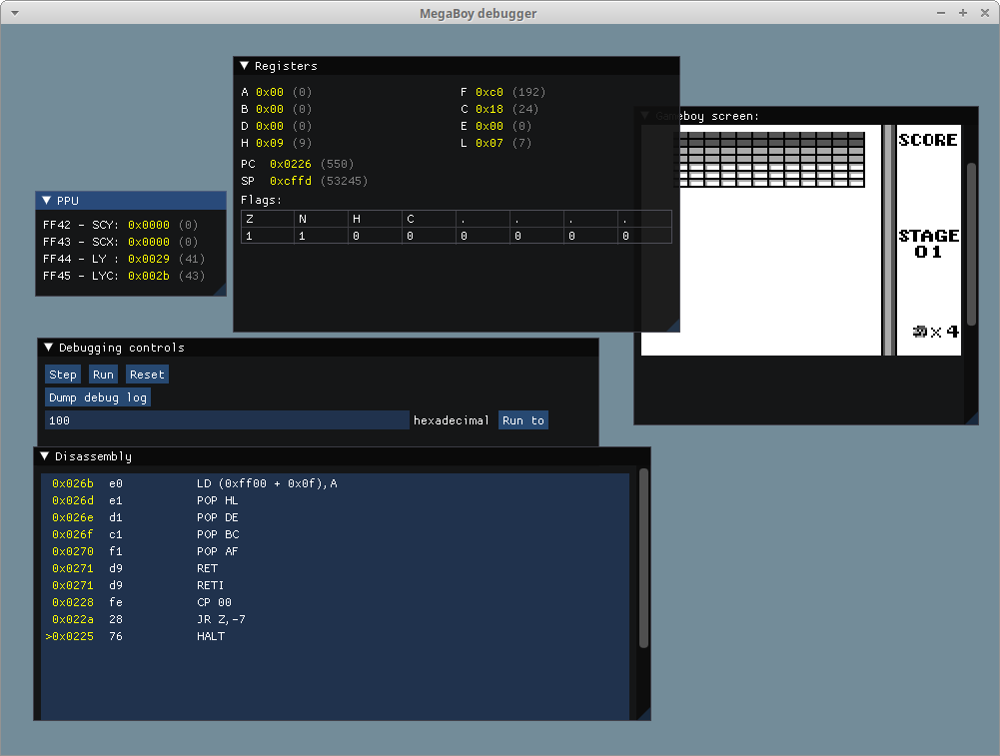

# MegaBoy

My first try at writing an emulator. 

Work in progress, and will probably rewrite large chunks of it a couple of times :)

**Screenshot**



**Status**

CPU emulator passes the following test ROMs:

```
01-special.gb
02-interrupts.gb
03-op sp,hl.gb
04-op r,imm.gb
05-op rp.gb
06-ld r,r.gb
07-jr,jp,call,ret,rst.gb
08-misc instrs.gb
09-op r,r.gb
10-bit ops.gb
11-op a,(hl).gb
halt_bug.gb
```

A few 32KB games plays but still with quite a few glitches.


**TODO**

 - Mappers (only 32KB games with no ROM mapper works right now)
 - Sound

**Gameboy docs**

https://www.pastraiser.com/cpu/gameboy/gameboy_opcodes.html

- https://gbdev.io/pandocs/
- https://gbdev.io/pandocs/CPU_Comparison_with_Z80.html
- https://github.com/AntonioND/giibiiadvance/ (GB/GBC/GBA emulator)
- https://github.com/AntonioND/giibiiadvance/blob/master/docs/TCAGBD.pdf (cycle accurate docs)

Gameboy Emulator development guide:
https://hacktixme.ga/GBEDG/ppu/

Other GB emulators:

- https://github.com/LIJI32/SameBoy/blob/master/Core/sm83_cpu.c
- https://github.com/AntonioND/giibiiadvance/blob/master/source/gb_core/cpu.c

**Test Roms**

- https://github.com/retrio/gb-test-roms/tree/master/cpu_instrs
- https://github.com/mattcurrie/dmg-acid2
- https://gbdev.gg8.se/wiki/articles/Gameboy_Bootstrap_ROM
- https://github.com/pinobatch/numism/blob/main/docs/gb_emu_testing.md

PPU timing tests
https://github.com/mattcurrie/mealybug-tearoom-tests
